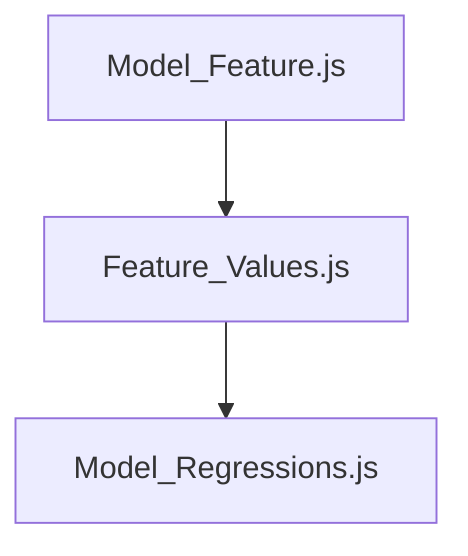

### Scripts
* **`Model_Feature.js`**: Generates 10m Sentinel-2 grid polygon asset that is filtered by spatial overlap with footprints. Adds properties for Sentinel-2 band values, NDVI, and MCARI.
* **`Feature_Values.js`**: Calculates 5cm BGR, LPI, and MFT and creates new feature class asset.
* **`Model_Regressions.js`**: Executes K-folds cross-validation and final models, visualizes prediction map, and exports predicted vs. true values.
