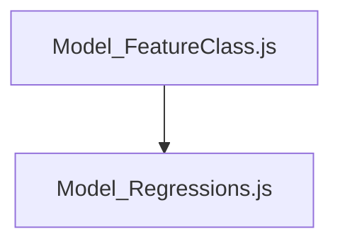

### Scripts
* **`Model_FeatureClass.js`**: Generates 10m Sentinel-2 grid feature class asset that is filtered by spatial overlap with footprints. Adds BGR, LPI, and MFT. Adds Sentinel-2 band values. Adds NDVI, MCARI, BSI, and NBR2.
* **`Model_Regressions.js`**: Executes K-folds cross-validation and final models, visualizes prediction map, and exports predicted vs. true values.
