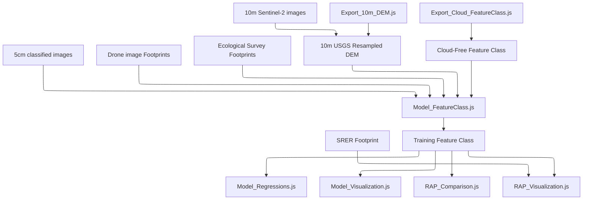

```mermaid
---
config:
  layout: elk
---
flowchart TD
    A[5cm classified images]
    B[Drone image Footprints]
    C[Ecological Survey Footprints]
    D[10m Sentinel-2 images]
    E[Export_10m_DEM.js]
    F[Export_Cloud_FeatureClass.js]
    G[SRER Footprint]
    
    H[10m USGS Resampled DEM]
    I[Cloud-Free Feature Class]
    
    J[Model_FeatureClass.js]
    K[Training Feature Class]
    
    L[Model_Regressions.js]
    M[Model_Visualization.js]
    N[RAP_Comparison.js]
    O[RAP_Visualization.js]
    
    A --> J
    B --> J
    C --> J
    D --> H
    E --> H
    F --> I
    G --> O
    
    H --> J
    I --> J
    
    J --> K
    K --> L
    K --> M
    K --> N
    K --> O
```

### Scripts
* **`Export_10m_DEM.js`**: Resamples the high-resolution 1m USGS 3DEP Digital Elevation Model to a 10m spatial resolution using a true spatial mean reduction to avoid aliasing errors, and exports it as a stripe-free asset.
* **`Export_Cloud_FeatureClass.js`**: Scans the 2018-2025 Sentinel-2 Harmonized record to locate the optimal 7-day imagery windows for each month based on a custom "True Obscuration" metric, exporting a feature class asset of the clearest dates.
* **`Model_FeatureClass.js`**: Generates 10m Sentinel-2 grid feature class asset that is filtered by spatial overlap with footprints. Adds BGR, LPI, and MFT. Adds Sentinel-2 band values. Adds NDVI, MCARI, BSI, and NBR2. Adds slope from 10m USGS DEM.
* **`Model_Regressions.js`**: Executes K-folds cross-validation and final models, visualizes prediction map, and exports predicted vs. true values.
* **`Model_Visualization.js`**: Loads the tuned Gradient Tree Boost models, resampled DEM, and optimal cloud windows to dynamically generate interactive, topography-aware predictive maps and local time-series charts.
* **`RAP_Comparison.js`**: Isolates drone-based ground truth data and compares it against the 10m Rangeland Analysis Platform (RAP) by computing Cumulative Distribution Functions (CDFs) to visualize fractional cover distributions.
* **`RAP_Visualization.js`**: Maps the spatial difference (residuals) between the custom SRER predictive model and the 10m RAP product, aggregating monthly predictions into an annual mean and providing an interactive pixel inspector for historical trends.
