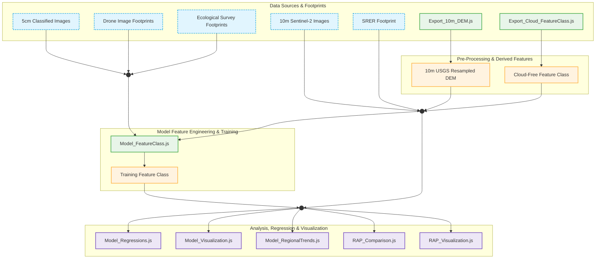

### GEE Workflow for Predictive Landscape Metric Maps

```mermaid
graph TD
  %% Styling Definitions
  classDef input fill:#e1f5fe,stroke:#039be5,stroke-width:2px,stroke-dasharray: 3 3;
  classDef intermediate fill:#fff3e0,stroke:#ffb74d,stroke-width:2px;
  classDef script fill:#e8f5e9,stroke:#4caf50,stroke-width:2px;
  classDef output fill:#ede7f6,stroke:#7e57c2,stroke-width:2px;
  classDef junction fill:#333,stroke:#333,circle;

  %% --- LEVEL 1: INPUT DATA & RAW TEXTURES ---
  subgraph Inputs [Data Sources & Footprints]
    I1["5cm Classified Images"]
    I2["Drone Image Footprints"]
    I3["Ecological Survey Footprints"]
    I4["10m Sentinel-2 Images"]
    I5["SRER Footprint"]
    
    %% Script-based pre-processing inputs
    S1["Export_10m_DEM.js"]
    S2["Export_Cloud_FeatureClass.js"]
  end

  %% --- LEVEL 2: PRE-PROCESSING & INTERMEDIATE PRODUCTS ---
  subgraph PreProcessing [Pre-Processing & Derived Features]
    P1["10m USGS Resampled DEM"]
    P2["Cloud-Free Feature Class"]
  end

  %% --- JOINTS ---
  J3(( )):::junction
  J1(( )):::junction
  J2(( )):::junction

  %% --- LEVEL 3: FEATURE ENGINEERING & TRAINING ---
  subgraph CoreModel [Model Feature Engineering & Training]
    S3["Model_FeatureClass.js"]
    T1["Training Feature Class"]
  end

  %% --- LEVEL 4: ANALYSIS & VISUALIZATION SCRIPTS ---
  subgraph Evaluation [Analysis, Regression & Visualization]
    O1["Model_Regressions.js"]
    O2["Model_Visualization.js"]
    O5["Model_RegionalTrends.js"]
    O3["RAP_Comparison.js"]
    O4["RAP_Visualization.js"]
  end

  %% --- FLOW CONNECTIONS ---
  %% Left-side footprint pipeline gathered to a joint to narrow the subgraph
  I1 --> J3
  I2 --> J3
  I3 --> J3
  J3 --> S3

  %% Pre-processing script connections
  S1 --> P1
  S2 --> P2

  %% --- INPUTS TO THE FIRST JOINT ---
  I4 --> J1
  P1 --> J1
  P2 --> J1
  I5 --> J1

  %% JOINT 1 TO FEATURE CLASS SCRIPT
  J1 --> S3

  %% Feature generation to training data
  S3 --> T1

  %% --- Top Joint directly to Bottom Joint ---
  J1 --> J2

  %% --- TRAINING DATA TO SECOND JOINT ---
  T1 --> J2

  %% --- JOINT 2 TO DOWNSTREAM SCRIPTS ---
  J2 --> O1
  J2 --> O2
  J2 --> O5
  J2 --> O3
  J2 --> O4

  %% Assigning Classes for Visual Distinction
  class I1,I2,I3,I4,I5 input;
  class P1,P2,T1 intermediate;
  class S1,S2,S3 script;
  class O1,O2,O3,O4,O5 output;
```
