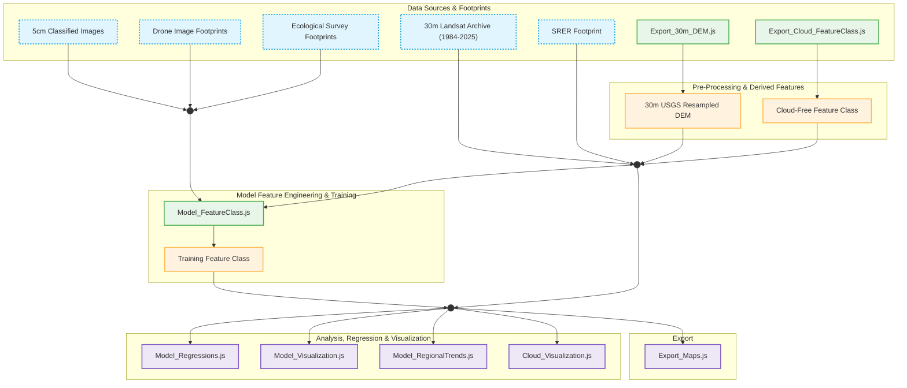

### GEE Workflow for Predictive Landscape Metric Maps

```mermaid
graph TD
  %% Styling Definitions
  classDef input fill:#e1f5fe,stroke:#039be5,stroke-width:2px,stroke-dasharray: 3 3;
  classDef intermediate fill:#fff3e0,stroke:#ffb74d,stroke-width:2px;
  classDef script fill:#e8f5e9,stroke:#4caf50,stroke-width:2px;
  classDef output fill:#ede7f6,stroke:#7e57c2,stroke-width:2px;
  classDef junction fill:#333,stroke:#333,circle;

  %% --- LEVEL 1: INPUT DATA & RAW TEXTURES ---
  subgraph Inputs [Data Sources & Footprints]
    I1["5cm Classified Images"]
    I2["Drone Image Footprints"]
    I3["Ecological Survey Footprints"]
    I4["30m Landsat Archive (1984-2025)"]
    I5["SRER Footprint"]
    
    %% Script-based pre-processing inputs
    S1["Export_30m_DEM.js"]
    S2["Export_Cloud_FeatureClass.js"]
  end

  %% --- LEVEL 2: PRE-PROCESSING & INTERMEDIATE PRODUCTS ---
  subgraph PreProcessing [Pre-Processing & Derived Features]
    P1["30m USGS Resampled DEM"]
    P2["Cloud-Free Feature Class"]
  end

  %% --- JOINTS ---
  J3(( )):::junction
  J1(( )):::junction
  J2(( )):::junction

  %% --- LEVEL 3: FEATURE ENGINEERING & TRAINING ---
  subgraph CoreModel [Model Feature Engineering & Training]
    S3["Model_FeatureClass.js"]
    T1["Training Feature Class"]
  end

  %% --- LEVEL 4: ANALYSIS, VISUALIZATION & EXPORT ---
  subgraph Evaluation [Analysis, Regression & Visualization]
    O1["Model_Regressions.js"]
    O2["Model_Visualization.js"]
    O5["Model_RegionalTrends.js"]
    O6["Cloud_Visualization.js"]
  end

  subgraph Export [Export]
    O7["Export_Maps.js"]
  end

  %% --- FLOW CONNECTIONS ---
  %% Left-side footprint pipeline gathered to a joint to narrow the subgraph
  I1 --> J3
  I2 --> J3
  I3 --> J3
  J3 --> S3

  %% Pre-processing script connections
  S1 --> P1
  S2 --> P2

  %% --- INPUTS TO THE FIRST JOINT ---
  I4 --> J1
  P1 --> J1
  P2 --> J1
  I5 --> J1

  %% JOINT 1 TO FEATURE CLASS SCRIPT
  J1 --> S3

  %% Feature generation to training data
  S3 --> T1

  %% --- Top Joint directly to Bottom Joint ---
  J1 --> J2

  %% --- TRAINING DATA TO SECOND JOINT ---
  T1 --> J2

  %% --- JOINT 2 TO DOWNSTREAM SCRIPTS ---
  J2 --> O1
  J2 --> O2
  J2 --> O5
  J2 --> O6
  J2 --> O7

  %% Assigning Classes for Visual Distinction
  class I1,I2,I3,I4,I5 input;
  class P1,P2,T1 intermediate;
  class S1,S2,S3 script;
  class O1,O2,O5,O6,O7 output;
```

### Scripts

* **`Export_30m_DEM.js`**: Resamples the high-resolution 1m USGS 3DEP Digital Elevation Model to a 30m spatial resolution using a true spatial mean reduction (averaging 900 native pixels per output pixel). This avoids aliasing errors and ensures perfect grid alignment with the native Landsat scale for downstream topographic metrics.

* **`Export_Cloud_FeatureClass.js`**: Scans the complete 40-year (1984-2025) Landsat archive (Landsat 5, 7, 8, and 9) to generate a monthly temporal inventory. It employs a cross-sensor pixel-level median strategy, masks clouds/shadows, and enforces a 20% minimum clear-pixel threshold to build a feature class index of pristine monthly composite windows.

* **`Model_FeatureClass.js`**: Constructs a 30m grid aligned exactly with Landsat, filtering it by spatial overlap with the 5cm high-resolution drone footprints. It extracts 12 Landsat predictor variables (surface reflectance bands, NDVI, BSI, NBR2, slope, aspect, and illumination) and computes 6 exact structural ground truth metrics (BGR, LPI, MFT, absolute Herbaceous and Woody percentages, and the Log Herb-to-Woody Ratio) to create the master training dataset. Takes 15-30 min.

* **`Model_Regressions.js`**: Ingests the master 30m training feature class to construct and evaluate six distinct Gradient Tree Boost regression models. It executes K-folds (K=5) cross-validation, evaluates Root Mean Square Error (RMSE) for both testing and training phases, and exports a comprehensive CSV containing predicted vs. true values for all metrics to facilitate scatter plot generation and $R^2$ validation.

* **`Model_Visualization.js`**: A fully interactive UI application that trains the Gradient Tree Boost models on load and applies them to historical Landsat composites on the fly. It renders dynamic, topography-draped 30m predictive maps (with custom color palettes for herbaceous and woody layers) and allows users to click anywhere on the landscape to extract and visualize 40-year local time-series charts.

* **`Model_RegionalTrends.js`**: Iterates through the 40-year cloud-free monthly index, classifying each Landsat composite and applying an exact 30m spatial mean reduction across the entire SRER boundary. It exports the regionally averaged time-series data for all six metrics to a CSV for long-term Python-based ecological trend analysis.

* **`Export_Maps.ipynb`**: Iterates through the 40-year cloud-free monthly index, classifying each Landsat composite and applying an 30m spatial predictions across the entire SRER boundary. Submits batch export tasks directly to Google Drive. It stacks all 6 predictions (BGR, LPI, MFT, Herb, Woody, and Log HWR) into one multi-band 30m GeoTIFF per month.

### Data sources

* **`5cm Classified Images`**: https://gee-community-catalog.org/projects/srer_drone/

* **`Drone Image Footprints`**: https://www.arcgis.com/home/item.html?id=50b30d505bd2491e9412217139b7df83

* **`Ecological Survey Footprints`**: https://www.arcgis.com/home/item.html?id=50b30d505bd2491e9412217139b7df83

* **`Landsat 5 Images`**: https://developers.google.com/earth-engine/datasets/catalog/LANDSAT_LT05_C02_T1_L2

* **`Landsat 7 Images`**: https://developers.google.com/earth-engine/datasets/catalog/LANDSAT_LT07_C02_T1_L2

* **`Landsat 8 Images`**: https://developers.google.com/earth-engine/datasets/catalog/LANDSAT_LT08_C02_T1_L2 

* **`Landsat 9 Images`**: https://developers.google.com/earth-engine/datasets/catalog/LANDSAT_LT09_C02_T1_L2

* **`Export_30m_DEM.js`**: https://developers.google.com/earth-engine/datasets/catalog/USGS_3DEP_1m

* **`Export_Cloud_FeatureClass.js`**: https://developers.google.com/earth-engine/datasets/catalog/COPERNICUS_S2_SR_HARMONIZED

* **`SRER Footprint`**: https://www.arcgis.com/home/item.html?id=1fa8b9b97e844aaf8170a95c6e2a3b76 

